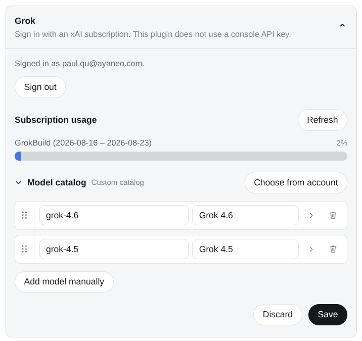

# @deepseek-ai/dsh-llm-grok

[English](README.md) | 中文

DeepSeek Harness 的 xAI Grok 集成。本插件使用独立的提供方路由（`grok`）和设置命名空间（`llm-grok`）。它不替代内置的 `xai` console API key 路由，也不声明 `apiKeyEnv`。

包根入口公开 Cordis plugin contract。同一 artifact 还导出 `./client`，在 Settings → LLM Providers 中提供 Grok 卡片。

## 安装

该包由 `dsh-base` 组合包提供，不需要单独安装。运行 `dsh web` 即可启动包含此提供方的 profile。

使用前，请在 Settings → LLM Providers → Grok 中完成 xAI 订阅登录。Host 会以仅属主可访问的权限保存 OAuth 会话。

## Web 配置

打开 Settings → LLM Providers → Grok。**用 xAI 登录**会在 Host 上对 `auth.x.ai` 走 PKCE（与 Grok CLI 同一公开 client），打开系统浏览器，并把会话只写在 Host 的 `$DSH_HOME/grok-oauth.json`（权限 `0600`）。卡片随后显示账号邮箱。退出登录会删除该文件。浏览器永远收不到 token。本插件不读、不写 `~/.grok/auth.json`。

### 插件配置

Plugin 卡上有两份目录：登录后从 `GET /v1/models-v2` 读到的账户列表，以及存进 `settings.models` 的显示子集。对话选择器只用显示子集。每行可设默认思考和作为 DSH 压缩预算的上下文窗口。官方 `grok-4.6` / `grok-4.5` 默认为 500,000 tokens。卡片上的目录默认折叠，可以拖动、改、删，或从账户列表里挑 1–2 个。尚未保存过时，默认显示 `grok-4.6` 和 `grok-4.5`。聊天走 `POST https://cli-chat-proxy.grok.com/v1/responses`。每条请求都带上 DSH function tools，以及始终开启的服务端 `{ type: "web_search" }` 与 `{ type: "x_search" }`。搜索不是 `ctx.web` 提供方。服务端搜索会以加密的 `tco_*` reasoning 项回放；这些项没有可见 summary，不会再各画一个空 Think 块。若 Grok 把同一次搜索再回成客户端 `custom_tool_call`（`xs_call-*` / `ws_call-*`，名字常抄成 `x_keyword_search`），插件会丢掉，避免 DSH 报 `unknown tool`。推理按官方 Responses 字段 `reasoning: { effort }` 传递，取值为 `low` / `medium` / `high`（默认）/ `xhigh`（仅 4.6）。登录后卡片还会展示 Host 读取的订阅额度（`GET /v1/billing?format=credits`）。未登录不请求额度；无法识别的接口显示为不支持，而不是错误。

安装 `dsh-model-switch` v0.2+ 后，Grok 还会给统一的 `generate_image` 路由注册一个可选的 Image-only Adapter。它复用同一套认证实现，不注册 Search 或 Vision Adapter；独立运行行为不变。

可选的 **`grok_image_gen`**（默认关闭）会注册一个模型可调用的生图工具，走 Grok Imagine。它复用同一套 Host OAuth 会话，请求 `https://api.x.ai/v1/images/generations` —— 和 Grok Build 本地 `image_gen` 同一条轨，不是 console API key，也不是聊天 proxy。工具名与 Codex 的 `codex_generate_image` 区分。生成的图会写到工作区并通过 attachment store 落盘。

未登录就聊天会失败为 `MISSING_CREDENTIAL`。已有会话但 refresh 失败会清会话并失败为 `AUTH`。每次聊天请求前已经跑过 `ensureFreshSession`；之后的 401 不再在 Responses 层重试。

每条 proxy 请求都会带上本插件的 `X-Dsh-Plugin` 身份，以及 proxy 要求的 CLI 版本头（`x-grok-client-version` / `x-grok-client-identifier`）。缺版本会 426。这些头是兼容约束，不是冒充官方 CLI。

Models 页面如果列出 Grok，也只是 hint。因为本包不声明 `apiKeyEnv`，该行不应出现「缺 API key」红点。

## 配置

~~~yaml
- id: llm-grok
  name: '@deepseek-ai/dsh-llm-grok'
  config:
    streamIdleTimeoutMs: 300000
    retryPolicy:
      mode: normal
      maxRetries: 8
      backoff:
        initialDelayMs: 500
        maxDelayMs: 10000
        jitterRatio: 0.1
~~~

bundle 默认对符合条件的模型请求失败最多重试八次。xAI 容量不足/高需求失败归类为 `RATE_LIMIT`；临时可用性下降归类为 `SERVER`。

没有 `apiKeyEnv`，也没有用户可改的 base URL。`models` 是对话里显示的目录，是账户列表的一个子集。

## Model Experience

### Grok 订阅请求

#### 模型看到的内容

所选 Grok 模型会通过 Grok Responses proxy 接收 DSH 系统提示词、持久化会话历史、例如 `bash` 的 DSH 函数工具和配置的推理强度。适配器会加入服务端 Web 与 X 搜索工具；其提供方原生结果项保持可回放，同时不会产生空的 DSH 推理行。

#### Token 影响

Grok 的 token 化决定确切的输入和输出用量。推理与服务端搜索项可能增加输入或输出 token，即使它们不产生可见文本。已记录的工具调用和结果会进入后续请求。

#### KV Cache 影响

适配器保留请求顺序和提供方回放项。切换模型、推理强度、会话前缀或工具定义，可能从第一个不同项开始改变可复用前缀。

### 提供方响应

#### 模型看到的内容

下一次请求会包含已记录的 DSH 工具结果和提供方可回放的响应项。

#### Token 影响

工具结果、推理和可见响应文本会根据 Grok 的 token 化计入后续请求用量。

#### KV Cache 影响

保留的响应项可以支持提供方缓存复用；更改任意较早的项可能从该项开始使复用失效。

Responses 事件会转换为 DSH 推理、文本、工具调用、用量和结束分片。DSH 会执行客户端工具，并在下一次 Grok 请求前记录工具结果。
